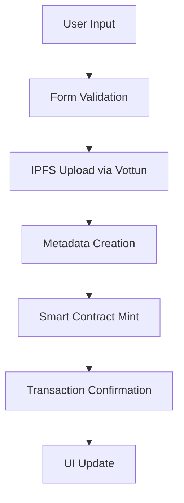
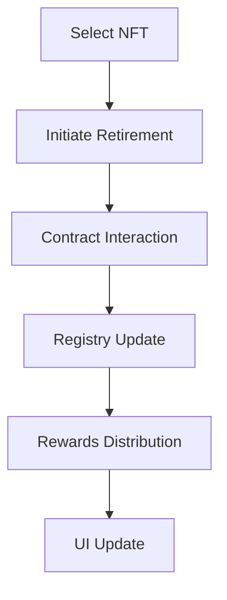

# EcoNFT - Carbon Credit NFT Marketplace

## Overview
EcoNFT is a revolutionary Web3 platform built on Arbitrum that transforms traditional carbon credits into NFTs, making carbon offset trading more accessible, transparent, and engaging. By leveraging blockchain technology and Vottun's powerful APIs, we're bringing much-needed innovation to the carbon credit market while promoting environmental sustainability.

## 🌟 Key Features
- Mint carbon credit NFTs with verified offset data
- Cross-chain functionality via Vottun APIs
- Interactive marketplace for trading carbon credits
- Gamified user experience with rewards system
- Real-time tracking of carbon offset impact
- Transparent verification standards
- User-friendly dashboard for portfolio management

## 🛠 Technical Architecture

### Smart Contracts (Arbitrum Sepolia)
- **EcoNFT.sol**: Main NFT contract for carbon credit tokenization
- **CarbonRegistry.sol**: Handles verification and tracking of carbon credits
- **Rewards.sol**: Manages the gamification and rewards system

### Frontend
- Next.js 15 with TypeScript for robust type safety
- Tailwind CSS for responsive design
- RainbowKit for seamless wallet integration
- Wagmi hooks for blockchain interactions

### Vottun API Integration
We chose Vottun's APIs for:
1. **IPFS Storage**: Secure, decentralized storage for NFT metadata
2. **NFT 721 API**: Simplified NFT management across chains
3. **Cross-chain Capabilities**: Enhanced liquidity and accessibility

## 💡 Innovation & Market Need
The voluntary carbon market is projected to reach $50B by 2030, but faces challenges:
- Lack of transparency
- Limited accessibility
- Complex verification processes
- Poor user experience

EcoNFT addresses these by:
- Making carbon credits easily tradeable as NFTs
- Providing transparent verification through blockchain
- Gamifying environmental impact
- Enabling fractional ownership of carbon credits

## 🎯 Technical Approach & Decisions

### Why Arbitrum?
- Low transaction costs
- High throughput
- Strong ecosystem support
- Environmental consciousness (Layer 2 efficiency)

### Why Vottun?
Our experience with Vottun APIs has been transformative:
1. **Simplified Integration**: Clean API design reduced development time
2. **Robust Documentation**: Clear guides and examples
3. **Cross-chain Support**: Essential for market liquidity
4. **IPFS Integration**: Reliable decentralized storage
5. **Technical Support**: Responsive and helpful team

### Security Considerations
- Role-based access control for contract functions
- Verified carbon credit sources
- Secure metadata storage
- Protected admin functions
- Pausable functionality for emergencies

## 🚀 Impact & Scalability
EcoNFT has the potential to:
- Accelerate carbon credit adoption
- Increase market transparency
- Lower barriers to entry
- Enable micro-transactions
- Foster community engagement

## 🎮 User Experience
- Intuitive minting process
- Real-time impact visualization
- Mobile-responsive design
- Seamless wallet integration
- Engaging rewards system

## 🔧 Technical Setup

### Installation
```bash
# Install dependencies
pnpm install

# Set up environment variables
cp .env.example .env.local

# Run development server
pnpm dev

# Deploy contracts
npx hardhat run scripts/deploy.ts --network arbitrumSepolia
```

### 🔧 Detailed Technical Architecture

#### Smart Contract Architecture
```solidity
contract EcoNFT is ERC721, ERC721URIStorage, ERC721Burnable, AccessControl {
    // Core functionality
    // - NFT minting with carbon credit verification
    // - Credit retirement mechanism
    // - Metadata management
    // - Access control for minting and admin functions
}

contract CarbonRegistry is AccessControl, Pausable {
    // Verification and tracking
    // - Credit verification system
    // - Retirement records
    // - Project registry
    // - Multi-standard support
}

contract Rewards is AccessControl {
    // Gamification system
    // - Point-based rewards
    // - Achievement badges
    // - Leaderboard management
    // - Special event handling
}
```

### Minting Process


### Retirement Process


### 📦 Comprehensive Setup Guide

#### Prerequisites
```bash
# Node.js version
Node.js >= 18.18.0

# Package manager
pnpm >= 8.0.0

# Supported networks
Arbitrum Sepolia
```

### Environment Setup

1. Clone the repository
   ```bash
   git clone https://github.com/yourusername/econft.git
   cd econft
   ```

2. Install dependencies
   ```bash
   pnpm install
   ```

3. Environment Variables
   Create a `.env.local` file with the following content:
   ```plaintext
   # Contract Addresses (after deployment)
   NEXT_PUBLIC_ECONFT_ADDRESS=your_deployed_econft_address
   NEXT_PUBLIC_CARBON_REGISTRY_ADDRESS=your_deployed_registry_address
   NEXT_PUBLIC_REWARDS_ADDRESS=your_deployed_rewards_address

   # API Keys
   NEXT_PUBLIC_WALLET_CONNECT_PROJECT_ID=your_wallet_connect_id
   NEXT_PUBLIC_VOTTUN_API_KEY=your_vottun_api_key

   # Deployment
   PRIVATE_KEY=your_wallet_private_key
   ARBISCAN_API_KEY=your_arbiscan_api_key
   ```

### Contract Deployment

1. Compile contracts
   ```bash
   npx hardhat compile
   ```

2. Deploy to Arbitrum Sepolia
   ```bash
   npx hardhat run scripts/deploy.ts --network arbitrumSepolia
   ```

3. Verify contracts
   ```bash
   npx hardhat verify --network arbitrumSepolia <CONTRACT_ADDRESS> <CONSTRUCTOR_ARGS>
   ```

### Frontend Development

Start the development server:
```bash
pnpm dev
```

### 🔍 Troubleshooting Guide

#### Common Issues & Solutions

**CORS Errors with Vottun API**
- Use API routes as a proxy.

```typescript
// src/app/api/vottun/ipfs/route.ts
export async function POST(req: NextRequest) {
  try {
    const formData = await req.formData();
    // Implementation
  } catch (error) {
    // Error handling
  }
}
```

**Contract Interaction Failures**
- Check wallet connection
- Verify network (Arbitrum Sepolia)
- Ensure sufficient gas
- Validate contract addresses

**IPFS Upload Issues**
- Debug steps:
  ```typescript
  console.log('Form data:', {
    filename: file.name,
    size: file.size,
    type: file.type
  });
  ```

- Verify headers:
  ```typescript
  headers: {
    'Authorization': `Bearer ${VOTTUN_CONFIG.API_KEY}`,
  }
  ```

**Hydration Errors**
- Use 'use client' directive
- Implement proper loading states
- Handle SSR carefully

### Error Messages & Solutions

- **"Invalid contract address"**
  - Verify environment variables
  - Check network configuration
  - Validate contract deployment

- **"Failed to upload to IPFS"**
  - Check file size limits
  - Verify API key
  - Monitor rate limits

- **"Insufficient funds"**
  - Get testnet tokens
  - Check gas prices
  - Optimize transactions

### Development Tips

**Local Testing**
- Deploy locally:
  ```bash
  npx hardhat run scripts/deploy.ts --network localhost
  ```

**Contract Verification**
- Flatten contracts:
  ```bash
  npx hardhat flatten
  ```

- Verify on Arbiscan:
  ```bash
  npx hardhat verify --network arbitrumSepolia <address> <args>
  ```

**Performance Optimization**
- Implement proper caching
- Optimize API calls
- Use appropriate data structures

**Security Best Practices**
- Regular audits
- Access control
- Input validation
- Error handling

## Need help? Contact:
- GitHub Issues
- Developer Discord
- Support Email